<p align="center">
  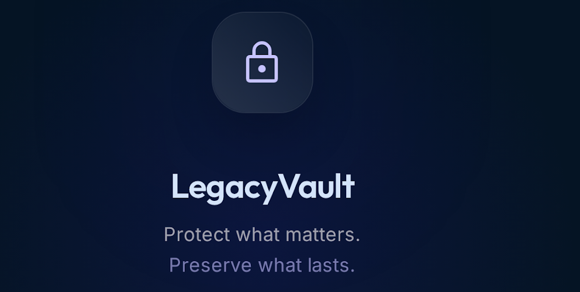
</p>

<h1 align="center">LegacyVault — Digital Estate & Legacy Platform (Backend)</h1>

> **Store once. Protect forever. Transfer securely.**
> A secure, mobile-first digital estate platform: store financial accounts, crypto,
> documents, passwords and final wishes in an encrypted vault, designate heirs, and
> release everything to them through a verified inheritance workflow.

- **Live API:** https://legacyvalut.fastapicloud.dev
- **Interactive docs (Swagger):** https://legacyvalut.fastapicloud.dev/docs
- **Stack:** FastAPI · SQLAlchemy 2.0 · PostgreSQL (Neon) · Redis · Cloudflare R2 · Resend · Firebase (Auth + FCM) · Paystack · deployed on **FastAPI Cloud**

---

## Table of contents

1. [What it does](#what-it-does)
2. [Architecture](#architecture)
3. [Project structure](#project-structure)
4. [Request lifecycle](#request-lifecycle)
5. [Key flows (system design)](#key-flows-system-design)
6. [Data model](#data-model)
7. [API surface](#api-surface)
8. [Configuration](#configuration)
9. [Local development](#local-development)
10. [Testing](#testing)
11. [Deployment (FastAPI Cloud)](#deployment-fastapi-cloud)
12. [Security model](#security-model)

---

## What it does

| Domain | Capabilities |
|---|---|
| **Identity** | Email/password + JWT (access/refresh), **Google sign-in via Firebase**, TOTP MFA, email verification (OTP), password reset (OTP), profile & notification/security settings, session management, data export |
| **Vault** | Encrypted vault items, assets (with valuation), documents (R2 upload + presigned reads, OCR, categories, expiry alerts) — all encrypted before persistence |
| **Beneficiaries** | Heirs CRUD, allocation %, verification; trusted contacts |
| **Inheritance** | Rule engine (trigger/conditions/toggle), distribution summary, access requests |
| **Verification** | Death-verification pipeline (certificate, witnesses, stages), emergency-access status |
| **Legacy** | Legacy notes (written/audio/video) with scheduled release, memory vault |
| **Subscriptions** | Free/Premium/Family plans, **Paystack** checkout + webhooks, billing history, plan-aware limits |
| **Notifications** | In-app feed + **FCM push** (HTTP v1), device registration, preferences |
| **Analytics / AI advisor** | Readiness score, asset distribution, coverage, trends; rule-based recommendations & risk |
| **Succession** | Generated succession reports + **PDF download** + secure share |
| **Admin** | KPI dashboard, user list, verification approve/reject |
| **Security** | AES (Fernet) field encryption, audit log, immutable trail |

---

## Architecture

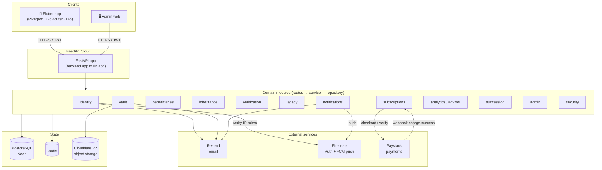

**Principles** (see `AGENTS.md`): domain-driven layout, routes only validate + delegate,
business rules in services, DB access in repositories, Pydantic request/response schemas,
sensitive data encrypted before persistence, UUID + opaque public IDs, soft deletes, audit logging.

---

## Project structure

```
backend/app/
├── core/            # config, database, security (JWT/Fernet/TOTP), deps, responses
├── shared/          # SQLAlchemy mixins (UUID PK, public_id, timestamps, audit, soft-delete)
├── integrations/    # email (Resend) + templates, storage (R2), push (FCM v1),
│                    # firebase_auth, paystack, pdf (fpdf2)
└── domains/
    ├── identity/        beneficiaries/      vault/         inheritance/
    ├── verification/    legacy/             subscriptions/ notifications/
    ├── analytics/       advisor/            succession/    dashboard/
    ├── security/        admin/
migrations/          # Alembic (0001 → 0006)
tests/               # pytest (69 tests)
scripts/             # smoke_test.py, push_env_to_cloud.py
main.py              # root ASGI entry point for FastAPI Cloud
```

Each domain follows the same shape:

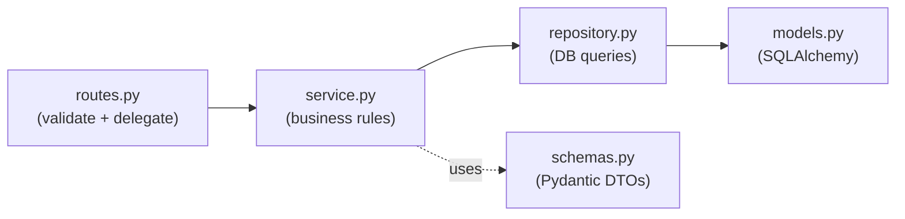

---

## Request lifecycle

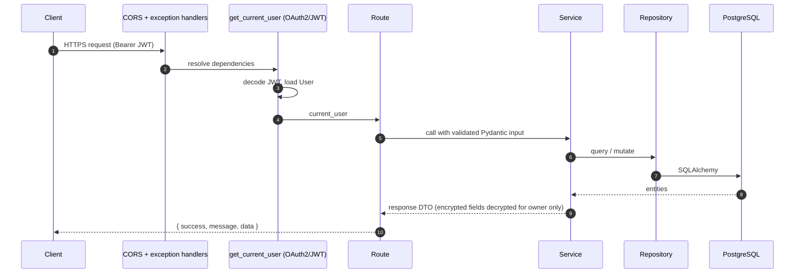

All responses use the envelope `{ "success": bool, "message": str, "data": ... }`;
errors use `{ "success": false, "message": str, "errors": [...] }`.

---

## Key flows (system design)

### 1. Authentication (password + Google)

```mermaid
sequenceDiagram
    autonumber
    participant App as Mobile app
    participant API
    participant FB as Firebase
    participant DB as PostgreSQL

    rect rgb(18,33,49)
    note over App,API: Email / password
    App->>API: POST /auth/register or /auth/login
    API->>DB: create / verify user (PBKDF2 hash)
    API-->>App: access + refresh JWT
    end

    rect rgb(13,28,45)
    note over App,FB: Google sign-in
    App->>FB: Google sign-in (Firebase SDK)
    FB-->>App: Firebase ID token
    App->>API: POST /auth/google { id_token }
    API->>FB: verify ID token (Google certs)
    API->>DB: find-or-create user (auth_provider=google)
    API-->>App: our access + refresh JWT
    end
```

The Swagger **Authorize** padlock uses the OAuth2 password flow against `POST /auth/token`,
backed by the same login service.

### 2. Email verification & password reset (OTP)

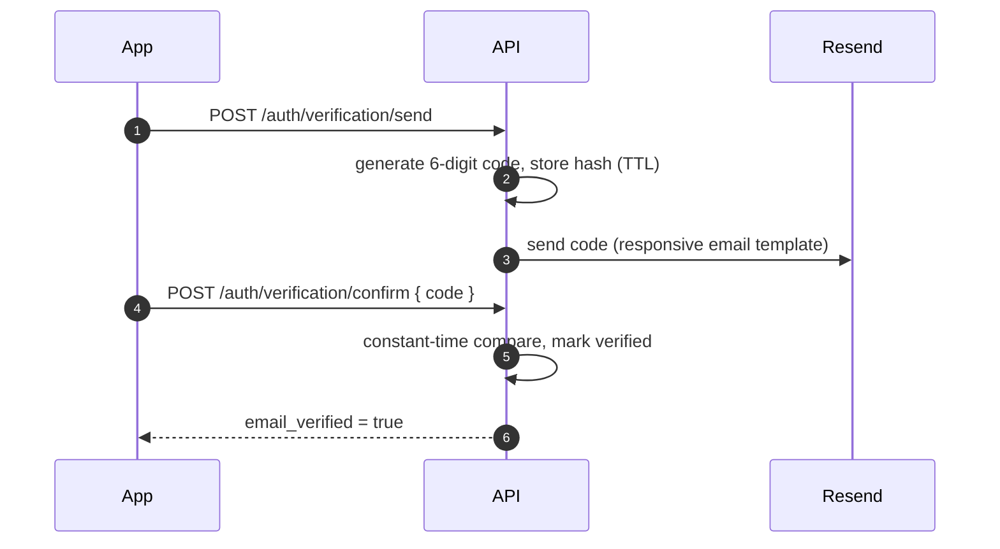

Password reset is identical via `/auth/password/forgot` → `/auth/password/reset`
(generic 200 on forgot to avoid account enumeration; all sessions revoked on reset).

### 3. Subscription payment (Paystack)

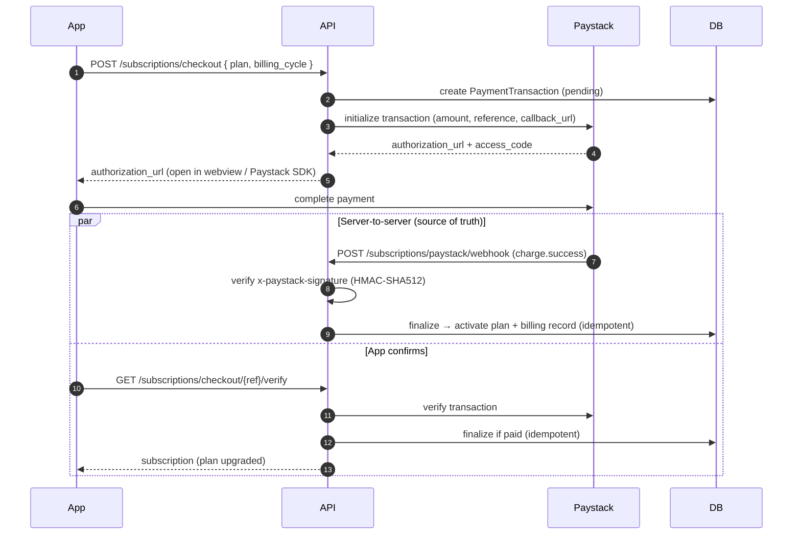

> **Mobile note:** the webhook is the reliable confirmation; the browser `callback_url`
> is just where the in-app webview lands so it can close and call the verify endpoint.

### 4. Inheritance & death verification

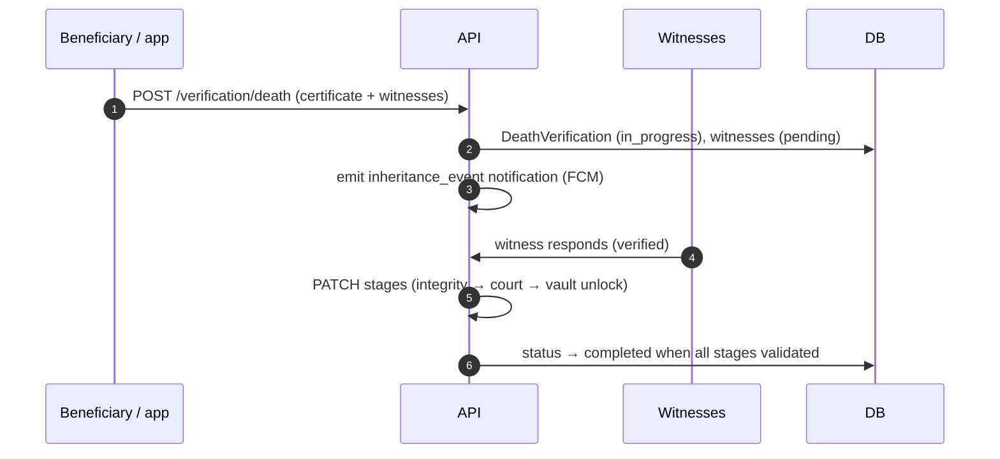

### 5. Push notification (FCM HTTP v1)

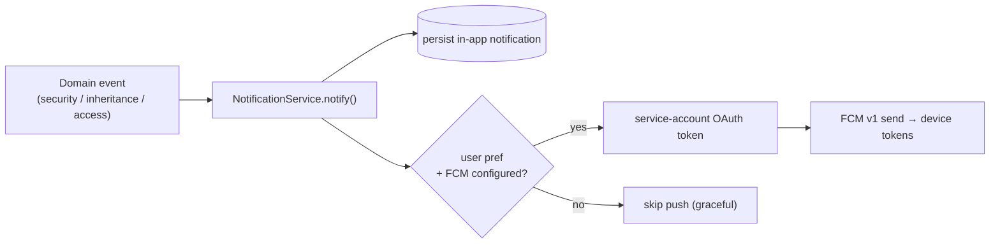

---

## Data model

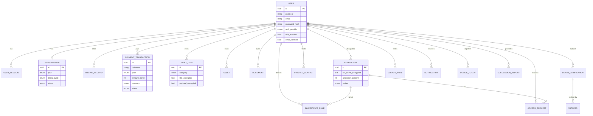

Every table has UUID PK + opaque `public_id`, `created_at/updated_at`, audit columns and
soft-delete. Sensitive fields are stored `*_encrypted` (Fernet/AES) and only decrypted for the owner.

---

## API surface

~100 endpoints under `/api/v1`. Highlights:

| Group | Examples |
|---|---|
| `auth` | register, login, **token** (Swagger), **google**, refresh, me, mfa/*, profile, notification/security-settings, sessions, **verification/send·confirm**, **password/forgot·reset**, export, logout |
| `vault` | items·assets·documents CRUD, documents/upload, /read-url, /categories, /expiring |
| `beneficiaries` · `trusted-contacts` | CRUD, /summary, /verify |
| `inheritance` | rules CRUD + toggle + distribution-summary, access-requests |
| `verification` | death (+witnesses, stages), emergency-access |
| `legacy` | notes (+scheduled), memories |
| `subscriptions` | plans, current, **checkout**, **checkout/{ref}/verify**, **paystack/webhook**, **paystack/callback**, change (free), cancel, billing-history |
| `notifications` | devices, list, read, read-all |
| `analytics` · `ai-advisor` | readiness, asset-distribution, coverage, trends, recommendations, risk, chat |
| `succession-reports` | generate, get, **/pdf**, /share |
| `dashboard` · `security` · `admin` | summary, audit-logs, login-history, dashboard, users, verifications/* |

Full schema at [`/docs`](https://legacyvalut.fastapicloud.dev/docs) and [`/openapi.json`](https://legacyvalut.fastapicloud.dev/openapi.json).

---

## Configuration

Copy `.env.example` → `.env`. Key variables:

| Variable | Purpose |
|---|---|
| `DATABASE_URL` | `postgresql+psycopg://…` (psycopg v3) |
| `REDIS_URL` | Redis connection |
| `SECRET_KEY` | JWT signing (64-char random) |
| `ENCRYPTION_KEY` | Fernet key for field encryption |
| `CLOUDFLARE_R2_*` | Document object storage |
| `RESEND_API_KEY`, `RESEND_FROM_EMAIL` | Transactional email |
| `FIREBASE_PROJECT_ID` | Verifies Google sign-in ID tokens |
| `FCM_SERVICE_ACCOUNT_BASE64` | Base64 service-account JSON for FCM v1 push |
| `PAYSTACK_SECRET_KEY` / `PAYSTACK_PUBLIC_KEY` | Payments |
| `PAYSTACK_CURRENCY` | e.g. `NGN` (amounts charged in its minor unit) |
| `PAYSTACK_CALLBACK_URL` | Where the payment webview lands |

> `POSTGRES_*` are only used by `docker-compose.yml` for a local Postgres container — not by the app.

---

## Local development

```bash
# 1. Install (uv recommended)
uv sync                       # or: pip install -e ".[dev]"

# 2. Configure
cp .env.example .env          # fill in values
python -c "import secrets; print(secrets.token_urlsafe(48))"          # SECRET_KEY
python -c "from cryptography.fernet import Fernet; print(Fernet.generate_key().decode())"  # ENCRYPTION_KEY

# 3. (optional) local Postgres + Redis
docker compose up -d

# 4. Migrate
alembic upgrade head

# 5. Run
fastapi dev main.py           # http://localhost:8000/docs
```

---

## Testing

```bash
pytest -q                                   # 69 unit/integration tests
pytest -q --cov=backend --cov-report=term   # ~91% coverage

# End-to-end smoke test against the configured DB (bypasses email/push/storage/paystack)
python scripts/smoke_test.py                # ~93 endpoint checks, 0 real emails sent
```

External side-effects are injected as fakes in tests; the suite is hermetic (no real
Resend/FCM/Paystack/Firebase calls).

---

## Deployment (FastAPI Cloud)

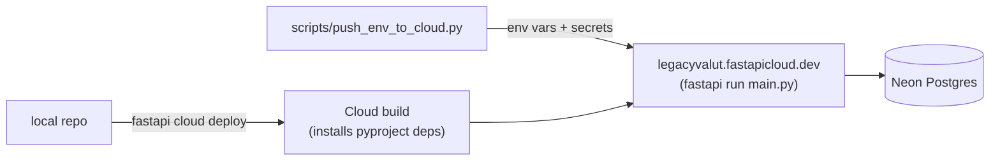

```bash
# one-time: install CLI + log in
pip install "fastapi[standard]"
fastapi login

# push env vars (reads .env, marks secrets, forces ENVIRONMENT=production)
python scripts/push_env_to_cloud.py

# deploy
fastapi cloud deploy --app-id f3825686-0180-4032-bb9d-aed168daf24e
```

**Paystack dashboard URLs to configure:**
- **Webhook URL:** `https://legacyvalut.fastapicloud.dev/api/v1/subscriptions/paystack/webhook`
- **Callback URL:** `https://legacyvalut.fastapicloud.dev/api/v1/subscriptions/paystack/callback`

Notes: the app entry point is the root `main.py` (re-exports `backend.app.main:app`);
`fastapi[standard]` is required because the platform runs `fastapi run`. Secrets (`.env`,
Firebase JSON) are git-ignored and excluded from upload by `rignore`.

---

## Security model

- **Encryption at rest:** vault items, asset metadata, document object keys/OCR, beneficiary
  names/instructions, legacy notes, MFA secrets, phone numbers, certificates — Fernet/AES, encrypted before persistence.
- **Auth:** PBKDF2 password hashing, JWT access/refresh, TOTP MFA, Firebase-verified Google sign-in, session revocation, password-reset invalidates all sessions.
- **Payments:** Paystack webhooks verified via `x-paystack-signature` (HMAC-SHA512); finalization is idempotent.
- **No leaks:** encrypted fields and internal UUIDs never returned; opaque `public_id`s used externally; audit trail for sensitive actions.
- **Graceful degradation:** email/push degrade to no-op when unconfigured; payments fail closed (503) when unconfigured.

---

🤖 Backend built with [Claude Code](https://claude.com/claude-code).
